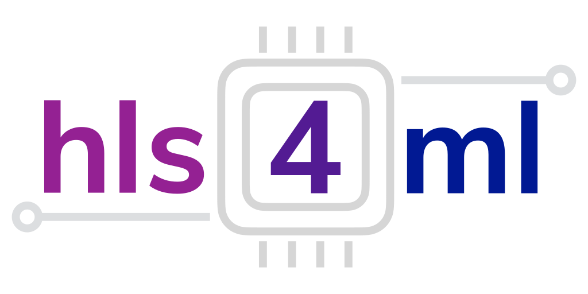
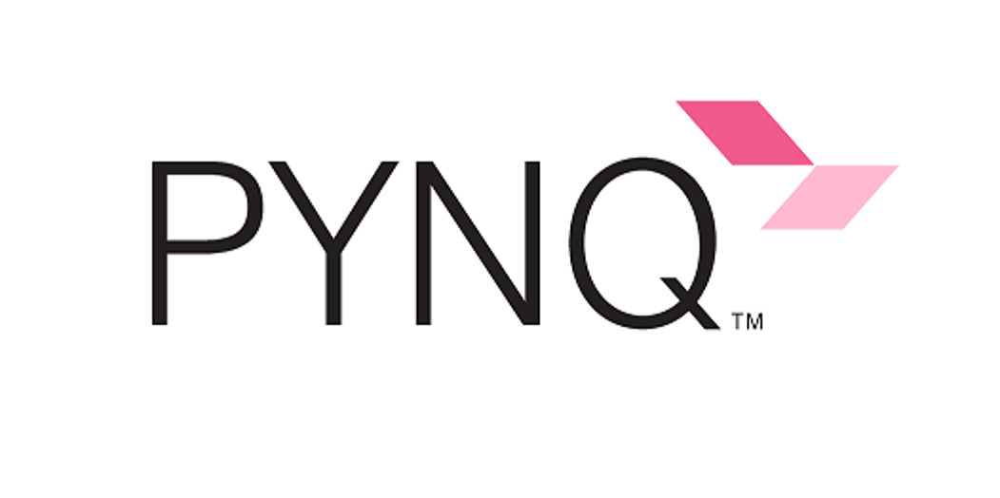

# Clasificación de Modulaciones usando una CNN en una FPGA Pynq-Z2

<p align="center" style:"display:">
  
  
</p>

Este proyecto ha sido desarrollado como parte del **Máster Universitario en Ingeniería en Tecnologías de Telecomunicación** de la **Universidad de Granada (UGR)**.

El objetivo principal es el estudio, análisis y clasificación automática de señales de radiofrecuencia (RF) utilizando técnicas de **Deep Learning** (Redes Neuronales Convolucionales - CNN). Además, el proyecto abarca la implementación y despliegue de estos modelos en hardware reconfigurable (**FPGA**) utilizando herramientas de síntesis de alto nivel como **hls4ml** para la placa **PYNQ-Z2**.

## 📋 Descripción

El proyecto se divide en tres bloques fundamentales:

1.  **Visualización y Análisis de Datos**: Herramientas para inspeccionar el dataset RadioML 2016.10a, visualizando constelaciones IQ, formas de onda y espectros de potencia.
2.  **Entrenamiento de Modelos**: Scripts para entrenar redes neuronales (CNN) capaces de clasificar esquemas de modulación (BPSK, QPSK, 8PSK, etc.) bajo distintas condiciones de ruido (SNR).
3.  **Despliegue en FPGA**: Flujo de trabajo completo para convertir los modelos entrenados en Keras a IP cores de hardware (HLS) y generar el bitstream para aceleración en FPGA.

## 🛠️ Requisitos y Tecnologías

El proyecto utiliza **Python 3.14** (gestionado vía Poetry) y las siguientes librerías clave:

*   **TensorFlow / Keras**: Construcción y entrenamiento de redes neuronales.
*   **hls4ml**: Conversión de modelos de Machine Learning a HLS para FPGAs.
*   **Numpy / Scipy**: Procesamiento numérico de señales.
*   **Matplotlib / Plotly**: Visualización de datos y resultados.

### Requisitos del Sistema (para síntesis FPGA)
*   **Xilinx Vivado (2019.2 o 2020.1 recomendado)**: Necesario para la síntesis y generación del bitstream si se ejecuta el flujo de hardware.

## 🚀 Instalación

Este proyecto utiliza **Poetry** para la gestión de dependencias, asegurando un entorno reproducible.

1.  **Clonar el repositorio:**
    ```bash
    git clone <url-del-repositorio>
    cd Proyecto_final
    ```

2.  **Instalar dependencias:**
    ```bash
    poetry install
    ```

3.  **Dataset:**
    Asegúrate de tener el archivo del dataset `RML2016.10a_dict.dat` (o `RML2016.10a_dict_v1.dat`) en la raíz del proyecto. Este dataset contiene las señales IQ etiquetadas.

## 📖 Uso y Funcionalidades

### 1. Visualización de Señales (`plot_iq.py` y `plot_waveforms.py`)

Estos scripts permiten explorar visualmente el dataset para entender la naturaleza de las señales RF.

*   **Diagramas de Constelación y Espectro:**
    ```bash
    poetry run python plot_iq.py
    ```
    *Genera gráficos de la constelación IQ y el espectro de potencia para una modulación y SNR específicos.*

*   **Formas de Onda en el Tiempo:**
    ```bash
    poetry run python plot_waveforms.py
    ```
    *Muestra las componentes I (In-phase) y Q (Quadrature) en el dominio del tiempo para vectores seleccionados.*

### 2. Entrenamiento del Modelo (`modeloentrenamiento.py`)

Entrena una CNN completa (basada en la arquitectura VT-CNN2) sobre todo el conjunto de modulaciones disponibles en el dataset.

```bash
poetry run python modeloentrenamiento.py
```
*   **Salida**: Guarda el modelo entrenado como `modelo_final_pynq.h5` y los pesos óptimos en `cnn2_best_weights.h5`.
*   Genera gráficas de precisión (accuracy) vs SNR y matrices de confusión.

### 3. Optimización y Despliegue en FPGA

Para llevar el modelo a una FPGA (PYNQ-Z2), utilizamos un flujo especializado que incluye cuantización y síntesis.

#### A. Entrenamiento Optimizado para FPGA (`redneuoronal_optima.py`)
Entrena una versión más ligera y eficiente del modelo, optimizada para hardware (menos parámetros, subset de modulaciones).
```bash
poetry run python redneuoronal_optima.py
```
*   **Salida**: `model_fpga.h5`.

#### B. Conversión y Generación de Bitstream (`hls4mlVivadoacelerator.py`)
Este es el script maestro para el flujo de hardware. Realiza las siguientes tareas:
1.  Carga y prepara los datos.
2.  Entrena/Carga el modelo.
3.  Configura `hls4ml` para usar la estrategia de latencia y precisión `ap_fixed<16,6>`.
4.  Ejecuta la síntesis con Vivado para generar el **Bitstream** (`.bit`) y el **Hardware Handoff** (`.hwh`).

```bash
poetry run python hls4mlVivadoacelerator.py
```
> **Nota:** Este proceso requiere tener Vivado instalado y en el PATH. Puede tardar entre 15 y 45 minutos.

## 📂 Estructura del Proyecto

*   `plot_iq.py`: Visualización de constelaciones y espectros.
*   `plot_waveforms.py`: Visualización de señales en el tiempo.
*   `modeloentrenamiento.py`: Entrenamiento de la CNN principal (Software baseline).
*   `redneuoronal_optima.py`: Entrenamiento de la CNN optimizada para FPGA.
*   `hls4mlVivadoacelerator.py`: Script "End-to-End" para generar el acelerador hardware (IP Core + Bitstream).
*   `conversionHls4ml.py`: Script auxiliar de conversión HLS (alternativo).
*   `RML2016.10a_dict.dat`: Dataset de entrada.
*   `pyproject.toml`: Configuración de dependencias (Poetry).

## 🎓 Autores y Créditos

**Autor:** Rodrigo García León, Lucía Fernández Carrascosas, Guillermo Albacete Fuentes.
**Máster:** Máster Universitario en Ingeniería de Telecomunicación  
**Universidad:** Universidad de Granada (UGR)  
**Asignatura:** Sistemas Electrónicos Integrados

---
*Este proyecto utiliza el dataset RadioML 2016.a basado en el trabajo de Tim O'Shea*
